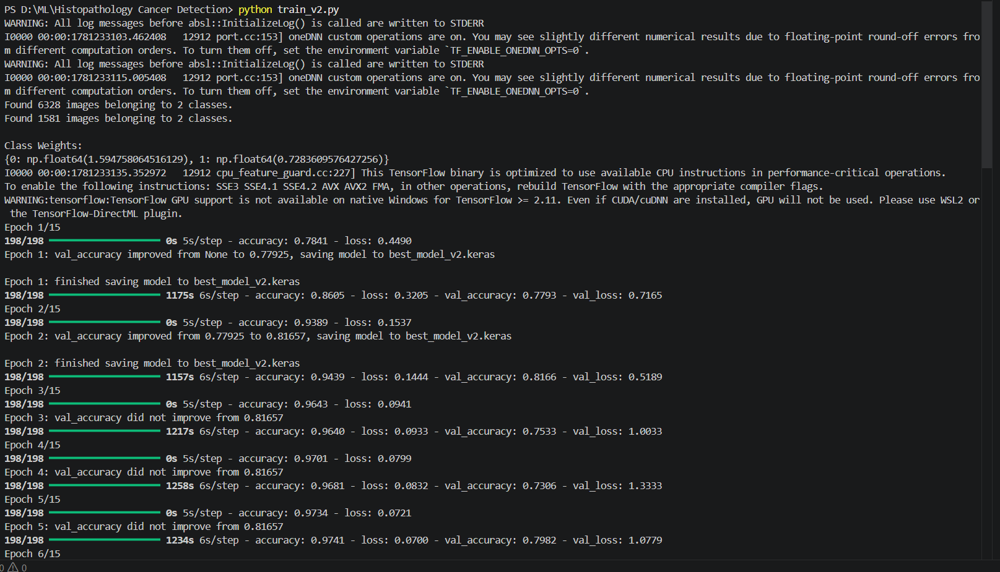
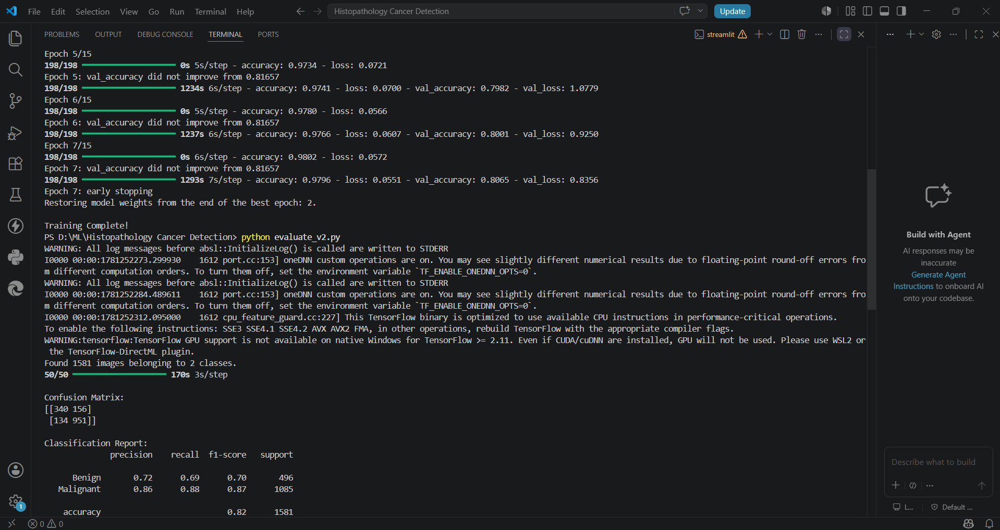
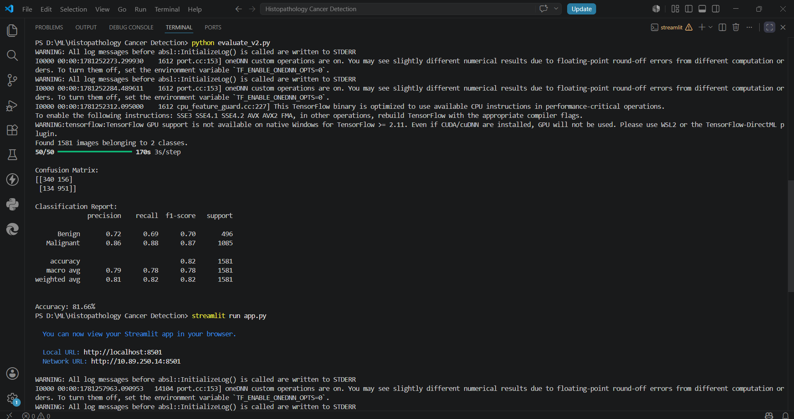
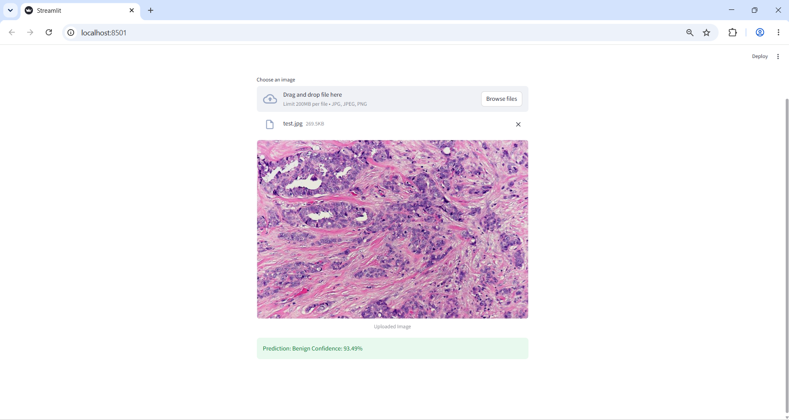

# Histopathology Cancer Detection Using Deep Learning

## Overview

This project focuses on the automated detection of breast cancer from histopathological images using Deep Learning techniques. A ResNet50 Transfer Learning model was trained on the BreakHis dataset to classify images into **Benign** and **Malignant** categories.

The project also includes a Streamlit web application that allows users to upload histopathology images and receive real-time predictions.

---

## Project Domain

* Artificial Intelligence (AI)
* Machine Learning (ML)
* Deep Learning (DL)
* Computer Vision
* Healthcare AI

---

## Features

* Breast Cancer Detection from Histopathology Images
* ResNet50 Transfer Learning Model
* Image Preprocessing and Augmentation
* Binary Classification (Benign / Malignant)
* Model Evaluation using Accuracy, Precision, Recall, and F1-Score
* Streamlit Web Application for Real-Time Predictions

---

## Dataset

### BreakHis (Breast Cancer Histopathological Database)

Dataset Link:

https://www.kaggle.com/datasets/ambarish/breakhis

### Dataset Statistics

* Total Images: 7,909
* Classes:

  * Benign
  * Malignant
* Magnification Levels:

  * 40X
  * 100X
  * 200X
  * 400X

---

## Technologies Used

* Python
* TensorFlow
* Keras
* ResNet50
* NumPy
* Scikit-learn
* Pillow
* Streamlit
* VS Code

---

## Model Architecture

* Transfer Learning using ResNet50
* Input Image Size: 224 × 224
* Binary Classification
* Adam Optimizer
* Early Stopping
* Model Checkpointing
* Data Augmentation

---

## Project Structure

Histopathology-Cancer-Detection/

├── screenshots/

├── sample_images/

├── train_v2.py

├── evaluate_v2.py

├── app.py

├── requirements.txt

├── README.md

└── .gitignore

---

## Files Included

* train_v2.py – Model training using ResNet50
* evaluate_v2.py – Model evaluation and performance metrics
* app.py – Streamlit web application
* requirements.txt – Project dependencies
* sample_images/test.jpg – Sample image for testing
* screenshots/ – Project screenshots and results

---

## Usage

### Train the Model

python train_v2.py

### Evaluate the Model

python evaluate_v2.py

### Run the Streamlit Application

streamlit run app.py

The application allows users to upload histopathology images and receive predictions as either Benign or Malignant along with a confidence score.

---

## Model Performance

| Metric    | Score  |
| --------- | ------ |
| Accuracy  | 81.66% |
| Precision | 86%    |
| Recall    | 88%    |
| F1 Score  | 82%    |

---

## Confusion Matrix

[[340 156]

[134 951]]

---

## Screenshots

### Model Training

### Training Completion

### Model Evaluation

### Streamlit Web Application

### Prediction Result

---

## Results

The model successfully classifies breast cancer histopathology images into Benign and Malignant categories using Deep Learning.

### Key Achievements

* Implemented ResNet50 Transfer Learning
* Achieved 81.66% Validation Accuracy
* Developed a Streamlit Web Application
* Built an End-to-End Deep Learning Pipeline
* Performed Medical Image Classification
* Real-Time Prediction of Histopathology Images

---

## Future Improvements

* Grad-CAM Visualization
* EfficientNet Comparison
* Multi-Class Cancer Classification
* Cloud Deployment
* Mobile Application Integration

---

## Author

### Pratiksha Uchil

M.Sc. Software Technology Student

St Aloysius Institute of Management & Information Technology (AIMIT), Mangalore

### Areas of Interest

* Artificial Intelligence (AI)
* Machine Learning (ML)
* Deep Learning (DL)
* Healthcare AI
* Computer Vision
* Data Science
* Java Development
* C Programming
* C++ Programming
* Software Development

---

## Acknowledgements

* BreakHis Dataset Contributors
* TensorFlow & Keras Community
* Streamlit Community
* St Aloysius Institute of Management & Information Technology (AIMIT)
